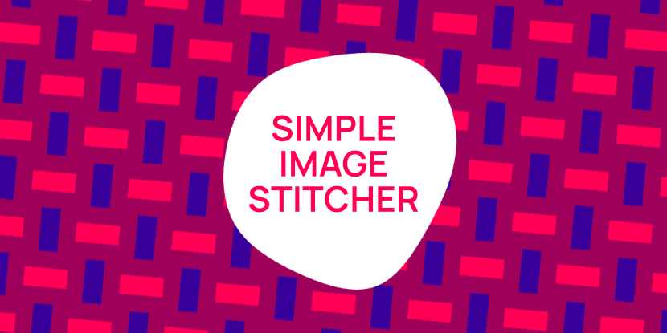

# Simple Image Stitcher

[](https://github.com/thinknathan/node-simple-stitcher/actions/workflows/ci.yml)

Command-line utility that stitches together images in a folder to form a single spritesheet. It uses a naive algorithm that is not the most efficient when handling images that have different dimensions.

## Install

1. Install [Nodejs](https://nodejs.org/en) or equivalent

2. Clone this project
   `git clone https://github.com/thinknathan/node-simple-stitcher`

3. Install dependencies
   `npm i`
   or
   `yarn`

4. Install for command-line usage
   `npm link`

## Usage

`stitch`

```
-f, --folder      Input folder containing images to stitch    [string] [required]
-c, --maxColumns  Maximum number of columns in the output image
                                                             [number] [required]
```

- Valid input formats: `jpeg`, `png`, `bmp`, `tiff`, `gif`
- Output format is `png`

## Background

Created with Chat-GPT 3.5.
